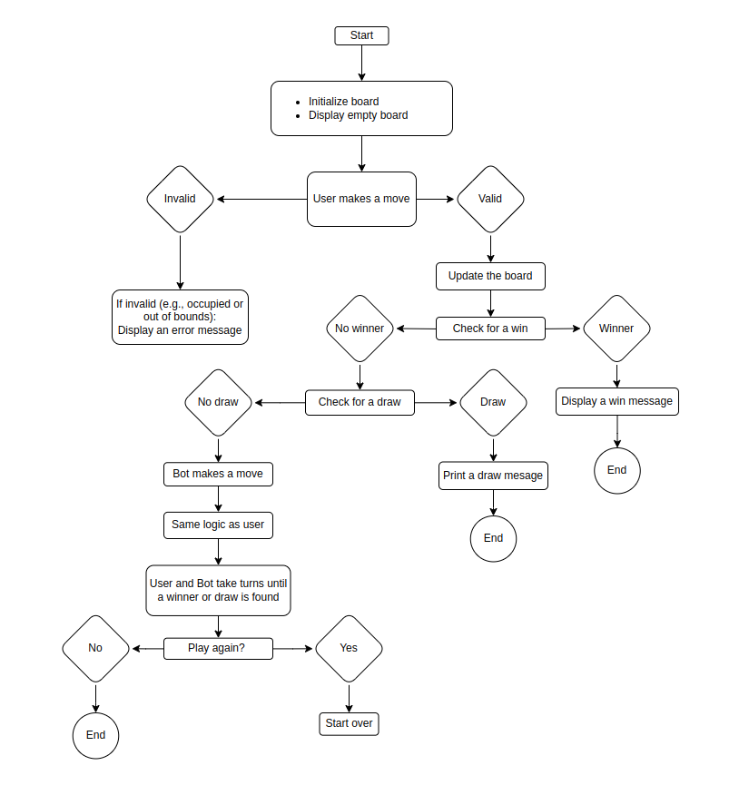
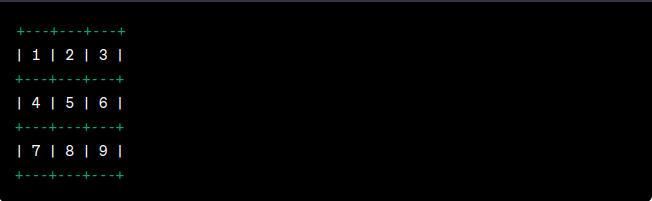

# Tic Tac Toe

Welcome to the ultimate Tic Tac Toe showdown! Are you ready to test your wits and strategic prowess? It's time to embark on an epic journey into the world of Xs and Os. You'll face off against a crafty bot, competing to be the first to complete a row, column, or diagonal with your 'X' marks. But beware, the bot won't make victory easy! So, gear up and get ready for an intense battle of wits. Do you have what it takes to outsmart the bot and emerge as the Tic Tac Toe champion? Let's find out!

[Play now](https://ci-tic-tac-toe-a4813875d9de.herokuapp.com/)


## Contents 📜

[Design](https://github.com/mistersouza/tic-tac-toe#design)

[How to play](https://github.com/mistersouza/tic-tac-toe#how-to-play)

[Features](https://github.com/mistersouza/tic-tac-toe#features)

[Data Model](https://github.com/mistersouza/tic-tac-toe#data-model)

[Testing](https://github.com/mistersouza/tic-tac-toe#testing)

[Deployment](https://github.com/mistersouza/tic-tac-toe#deployment)

[Tech](https://github.com/mistersouza/tic-tac-toe#tech-%EF%B8%8F)

[Credits](https://github.com/mistersouza/tic-tac-toe#credits)

## Design

Given that this program is tailored for terminal use, the emphasis was placed on functionality rather than intricate visual design. The game board and player tokens are represented using basic keyboard letters and symbols, with the added ANSI escape code to provide a visually appealing and engaging experience.



## How to play

### Objective

The objective of Tic Tac Toe is to be the first player to get three of your marks in a row, column, or diagonal on the 3x3 game board.

### Starting the Game

1. Open the Tic Tac Toe game on your device.

### Player Assignment

2. In most Tic Tac Toe games, one player is "X," and the other is "O."
3. The "X" player usually goes first.

### Game Board

4. You'll see a 3x3 grid on the screen, initially empty. Each cell is labeled with a number from 1 to 9, as shown below:



### Taking Turns

5. The "X" player goes first.
6. Players take turns to make their moves.

### Making a Move

7. When it's your turn, you will be prompted to select a cell by entering the corresponding number (e.g., 1, 5, 9).
8. The cell you choose will be marked with your symbol ("X" or "O").

### Winning the Game

9. The game continues until one player gets three of their symbols in a row, column, or diagonal. That player wins the game.
10. The winning combinations are:
 - Three in a row: Across the top, middle, or bottom row.
 - Three in a column: Down the left, middle, or right column.
 - Three diagonally: From the top-left to the bottom-right or from the top-right to the bottom-left.

### End of the Game

11. If one player wins, the game will announce the winner.
12. If all cells are filled, and no player wins, the game will end in a draw (a tie).

### Play Again

13. After a game ends, you can choose to play another round.
14. If you want to play again, the game will reset the board, and you can continue playing.
15. If you don't want to play again, you can exit the game.

### Enjoy the Game

16. Have fun playing Tic Tac Toe with your opponent!

### Strategies

17. You can try different strategies to outsmart your opponent, but remember that Tic Tac Toe is a game of skill and strategy.

Now you're ready to enjoy a game of Tic Tac Toe! Take turns, plan your moves, and aim to be the first to get three in a row. Good luck and have fun!

## Features

### Existing features

__Custom layout__ Say hello to our wicked terminal setup and rad background image. It's like we're giving your game an exclusive VIP lounge


__Interactive Guide__ New to the game? No worries! We've got an interactive guide that'll teach you how to play like a pro, right on your custom background.


__Randomly Smart Bot__ Challenge a bot that makes clever, random moves. It's not just any bot; it's a stylish and smart one.

__Winning Highlight__ When you emerge victorious, we'll make sure your epic moves shine brightly against the custom background.


__Tie or Draw__ If no one conquers the grid, we'll call it a draw. Tic-Tac-Toe drama at its finest, set against a stylish backdrop.


__Play Again__ Feel like another round? You can restart the epic showdown with a single keystroke, all on your sleek custom terminal.


### Future features

Coming up son

__Multiplayer Mode__ Challenge your friends and see who's the ultimate champion.

__AI Bot Opponent__ Test your skills against our cunning AI bot.

## Data Model

The selected data model for our Tic Tac Toe game, a two-dimensional list representing the 3x3 game board, is the most suitable choice. This model perfectly mirrors the game's structure and simplifies game logic. It aligns seamlessly with the game's rules, enabling intuitive player interactions and streamlined win checks.

This data model's simplicity and efficiency offer excellent flexibility for potential future features like larger grids, additional players, or alternative win conditions, making it the ideal choice to keep the game adaptable and entertaining while staying true to the classic Tic Tac Toe experience.

## Testing

I've given this project a solid manual run-through, just to make sure everything's smooth and snappy. I also ran it through a PEP* inter, and it's all clear on that front—no problems to see here.

I threw some curveballs too, like tossing in strings when it expected numbers and venturing into out-of-bounds territory. The game handled it like a champ.

To top it off, I gave it a spin on my trusty local terminal and even unleashed it in the wilds of the Code Institute Heroku terminal. It's all good, no hiccups.

### Bugs

We managed to prevent unintended terminal output printed red after handling invalid input by applying the `continue` get_user_next_move definition. This statement allows us to skip the current loop iteration when invalid input is detected, ensuring that only valid inputs are processed and displayed in the terminal, thus improving the user experience.

```python
    def get_user_next_move(board):
    '''
    Get user to input next move by typing a number from 1 to 9. 
    It's not going to let you move to a spot that's already been claimed.
    '''
    while True:
        try: 
            next_move = int(input("What's your move, superstar? Pick a number from 1 to 9: "))
            if validate_move(next_move, board):
                move, mark = (next_move, 'X')
                board = update_board(board, move, mark)
                return board
        except ValueError:
            print(ANSI_RED + f'Oops, that\'s not a valid move. Try again, champ!' + ANSI_RESET)
            continue
```
### Ongoing Bug Hunt

Our bug-busting adventure is ever going!

## Deployment

This project was brought to life using Code Institute's mock terminal for Heroku 🚀 

- Here's the playbook:
    - First, fork or clone this epic repo.
    - Head over to Heroku and create a brand-new app.
    - Set the buildpacks like a pro – Python and Node.js, in that order.
    - Now, link your Heroku app to the repo where the action's happening.
    - Finally, just tap that 'Deploy' button like a champ! 💥

Watch your game come to life on [Heroku](https://ci-tic-tac-toe-a4813875d9de.herokuapp.com/)

## Tech 🛠️

### Languages

_Web trinity +

+ Python
+ HTML
+ CSS
+ JS

### Software

_Toolkit

+ VS Code, coding
+ draw.io , flowchart
+ Git, version controlling
+ GitHub, sharing, deploying, and other cool stuff

## Credits

Indeed, I've been the lone architect behind the planning, design, and code, but I couldn't have pulled it off without some helping hands. And honestly, I wouldn't want it any other way. The collaborative spirit of programming is truly one of the things I cherish the most about this journey.

### Goodies 
+ [unsplash](https://unsplash.com/s/photos/splash)
    + 'Cause it makes everything look oh-so-pretty!
+ Chat GPT
    + This AI buddy was the brain behind it all. It's been our chit-chat partner throughout.
```python
def get_winner_moves(board):
    '''
    Snag the game-winning moves!
    '''
    winning_moves = []
    for combination in winning_combinations:
        if all(board[row][col] == 'X' for row, col in combination):
            winning_moves.extend(combination)
        elif all(board[row][col] == 'O' for row, col in combination):
            winning_moves.extend(combination)  
    return winning_moves  
```

### Inpired by

+ Code Institute's [Love Sandwiches](https://github.com/mistersouza/love-sandwiches.git)
+ [Clever Programmer](https://youtu.be/BHh654_7Cmw?si=G6NMco2kre3hysJX)

### Thanks

+ David Calikes, Code Institute Cohort Facilitator.
    + Positive and Uplifting. David's Always available and boosts my confidence time we chat.
+ Oluwafemi Medale, Code Institute Mentor.
    + Bugs terminator. He always make times, when there's no time at all.
+ Chat GPT, Here comes Mister know it all again.
    + Documenting King. Not always correct, but frequently inspiring.
